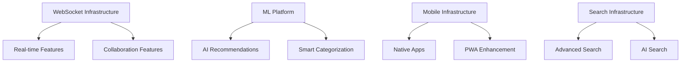
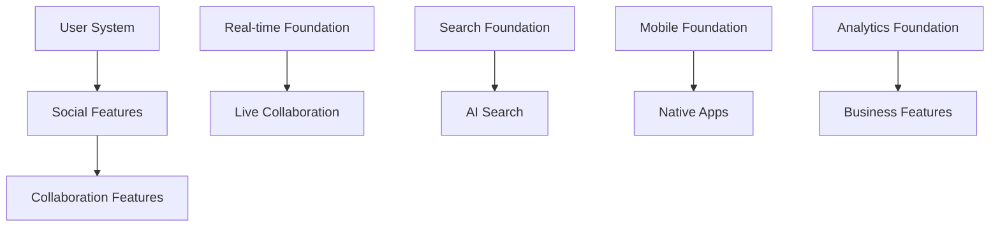

# ✨ Feature Development Roadmap

This document outlines planned features for Wanderlist, organized by priority, timeline, and implementation complexity.

## 🎯 Feature Categories

### **📱 Mobile & Cross-Platform**
- Progressive Web App enhancements
- Native mobile applications
- Desktop applications
- Browser extensions
- Cross-platform synchronization

### **🤝 Social & Collaboration**
- Real-time collaboration features
- Social discovery and sharing
- Community building tools
- User engagement features
- Content moderation systems

### **🔍 Search & Discovery**
- AI-powered search capabilities
- Advanced filtering and sorting
- Personalized recommendations
- Geographic discovery
- Content categorization

### **🤖 AI & Automation**
- Machine learning recommendations
- Smart categorization
- Automated content moderation
- Predictive analytics
- Natural language processing

---

## 🗓️ Feature Timeline

### **Q3 2025 (July - September)**

#### **🏆 High Priority Features**

##### **Progressive Web App Enhancement**
**Timeline**: 6-8 weeks  
**Dependencies**: Service worker infrastructure, push notification setup  
**Complexity**: Medium

**Features**:
- **Offline Support** - Cache lists and places for offline viewing
- **Push Notifications** - Real-time notifications for list interactions
- **App-like Experience** - Full-screen mode, app install prompts
- **Background Sync** - Sync changes when connection restored

**Success Metrics**:
- 90%+ offline functionality coverage
- <3s app install time
- 80%+ notification engagement rate

##### **Advanced Search Implementation**
**Timeline**: 8-10 weeks  
**Dependencies**: Search infrastructure, AI/ML setup  
**Complexity**: High

**Features**:
- **Semantic Search** - Natural language place and list search
- **Voice Search** - Voice-to-text search functionality
- **Visual Search** - Search by uploaded photos
- **Smart Filters** - AI-powered filtering suggestions

**Success Metrics**:
- 40% improvement in search success rate
- <500ms search response time
- 60%+ voice search adoption

##### **Real-time Features Foundation**
**Timeline**: 10-12 weeks  
**Dependencies**: WebSocket infrastructure, database optimization  
**Complexity**: High

**Features**:
- **Live Updates** - Real-time list and place updates
- **Presence Indicators** - Show active users on lists
- **Live Notifications** - Instant interaction notifications
- **Conflict Resolution** - Handle simultaneous edits

**Success Metrics**:
- <100ms real-time update latency
- 99.9% message delivery rate
- Zero data conflicts

#### **🎯 Medium Priority Features**

##### **Social Features Phase 1**
**Timeline**: 6-8 weeks  
**Dependencies**: User system enhancement, moderation tools  
**Complexity**: Medium

**Features**:
- **List Comments** - Comment system for public lists
- **Rating System** - Star ratings for lists and places
- **Basic Following** - Follow users to see their new lists
- **Activity Feed** - Timeline of followed users' activities

**Success Metrics**:
- 30%+ engagement rate on comments
- 70%+ lists receive ratings
- 25%+ users follow others

---

### **Q4 2025 (October - December)**

#### **🏆 High Priority Features**

##### **Native Mobile Apps Development**
**Timeline**: 12-16 weeks  
**Dependencies**: React Native setup, app store accounts  
**Complexity**: Very High

**Features**:
- **iOS Application** - Native iOS app with platform-specific features
- **Android Application** - Native Android app with Material Design
- **Offline Functionality** - Full offline list management
- **Location Services** - Enhanced GPS integration and geofencing

**Success Metrics**:
- 4.5+ app store rating
- 50%+ mobile user adoption
- <2s app launch time

##### **AI Recommendations Engine**
**Timeline**: 10-12 weeks  
**Dependencies**: ML infrastructure, user behavior data  
**Complexity**: Very High

**Features**:
- **Personalized Suggestions** - AI-powered place recommendations
- **Smart List Creation** - Auto-suggest places for new lists
- **Trending Detection** - Identify trending places and lists
- **Behavioral Analytics** - User preference learning

**Success Metrics**:
- 60%+ recommendation acceptance rate
- 40% increase in list creation
- 25% improvement in user engagement

##### **Collaboration Features**
**Timeline**: 8-10 weeks  
**Dependencies**: Real-time infrastructure, permission system  
**Complexity**: High

**Features**:
- **Multi-user Editing** - Collaborative list editing
- **Permission Management** - Granular access controls
- **Edit History** - Track changes and contributors
- **Shared Workspaces** - Team-based list organization

**Success Metrics**:
- 40%+ lists become collaborative
- <200ms collaborative edit latency
- 90%+ edit conflict resolution

#### **🎯 Medium Priority Features**

##### **Business Features**
**Timeline**: 8-10 weeks  
**Dependencies**: Business account system, analytics infrastructure  
**Complexity**: Medium

**Features**:
- **Business Profiles** - Enhanced profiles for businesses
- **Analytics Dashboard** - Business insights and metrics
- **Promoted Places** - Advertising opportunities
- **Review Management** - Business response to reviews

**Success Metrics**:
- 100+ business sign-ups
- 20%+ promoted place engagement
- 80%+ business satisfaction

---

### **Q1 2026 (January - March)**

#### **🏆 High Priority Features**

##### **Advanced AI Features**
**Timeline**: 12-14 weeks  
**Dependencies**: ML platform, computer vision setup  
**Complexity**: Very High

**Features**:
- **Smart Categorization** - Auto-categorize places using ML
- **Duplicate Detection** - Automatically detect and merge duplicates
- **Content Moderation** - AI-powered content filtering
- **Image Recognition** - Identify places from photos

**Success Metrics**:
- 95%+ categorization accuracy
- 90%+ duplicate detection rate
- <1% false positive moderation

##### **Enterprise Features**
**Timeline**: 10-12 weeks  
**Dependencies**: Enterprise infrastructure, billing system  
**Complexity**: High

**Features**:
- **Team Accounts** - Multi-user enterprise accounts
- **Advanced Permissions** - Role-based access control
- **SSO Integration** - Single sign-on for enterprises
- **Audit Logging** - Comprehensive activity tracking

**Success Metrics**:
- 10+ enterprise customers
- 99.9% SSO reliability
- Complete audit trail coverage

---

## 🔄 Feature Dependencies

### **Infrastructure Dependencies**

### **Feature Dependencies**

---

## 📊 Feature Prioritization Matrix

### **High Impact, Low Effort**
1. **Push Notifications** - High user engagement, moderate implementation
2. **Basic Social Features** - Community building, existing infrastructure
3. **Voice Search** - Accessibility improvement, API integration

### **High Impact, High Effort**
1. **Native Mobile Apps** - Platform expansion, significant development
2. **AI Recommendations** - User engagement, complex ML implementation
3. **Real-time Collaboration** - Core feature, infrastructure overhaul

### **Medium Impact, Low Effort**
1. **Advanced Filters** - User convenience, database optimization
2. **Export Features** - User utility, data processing
3. **Keyboard Shortcuts** - Power user features, UI enhancement

### **Medium Impact, High Effort**
1. **AR Integration** - Future technology, experimental implementation
2. **Multi-language Support** - Global expansion, localization effort
3. **Advanced Analytics** - Business intelligence, data infrastructure

---

## 🎯 Success Metrics by Feature Category

### **Mobile & Cross-Platform**
- **App Store Rating**: >4.5 stars
- **Mobile User Adoption**: >60% of users
- **Cross-platform Sync**: 99.9% reliability
- **Offline Usage**: >40% of mobile sessions

### **Social & Collaboration**
- **User Engagement**: 50% increase in session time
- **Content Creation**: 30% increase in list creation
- **Community Growth**: 25% monthly active user growth
- **Collaboration Adoption**: >40% of lists become collaborative

### **Search & Discovery**
- **Search Success Rate**: >80% successful searches
- **Discovery Engagement**: >30% click-through rate
- **Recommendation Accuracy**: >70% acceptance rate
- **Search Performance**: <300ms average response time

### **AI & Automation**
- **AI Feature Adoption**: >50% user engagement
- **Automation Accuracy**: >90% correct predictions
- **Content Quality**: 50% reduction in moderation needs
- **User Satisfaction**: >4.0 AI feature rating

---

## 🔗 Related Documentation

### **Implementation Guides**
- **[Architecture Plans](./architecture.md)** - Technical architecture for new features
- **[Performance Roadmap](./performance.md)** - Performance considerations for features
- **[Technical Debt](./technical-debt.md)** - Technical improvements needed

### **Current State**
- **[API Documentation](../api/)** - Current API capabilities and patterns
- **[Component Library](../components/)** - Available UI components
- **[Performance Status](../performance/)** - Current performance baseline

### **Strategic Context**
- **[Roadmap Overview](./README.md)** - Overall development strategy
- **[Migration History](../history/)** - Lessons learned from previous development

---

## 📝 Feature Request Process

### **Feature Proposal**
1. **User Research** - Validate user need and demand
2. **Technical Assessment** - Evaluate implementation complexity
3. **Business Impact** - Assess potential business value
4. **Resource Planning** - Estimate development effort and timeline

### **Feature Development**
1. **Design Phase** - UI/UX design and user flow
2. **Technical Design** - Architecture and implementation plan
3. **Development** - Implementation with testing
4. **Beta Testing** - Limited release and feedback collection
5. **Full Release** - Production deployment and monitoring

### **Feature Success Evaluation**
1. **Adoption Metrics** - User engagement and usage patterns
2. **Performance Impact** - System performance and reliability
3. **User Feedback** - Satisfaction and improvement suggestions
4. **Business Impact** - Revenue, retention, and growth metrics

---

*✨ This feature roadmap is regularly updated based on user feedback, technical capabilities, and business priorities. Features may be reprioritized or rescheduled based on changing requirements and opportunities.*

*Last Updated: June 10, 2025* 